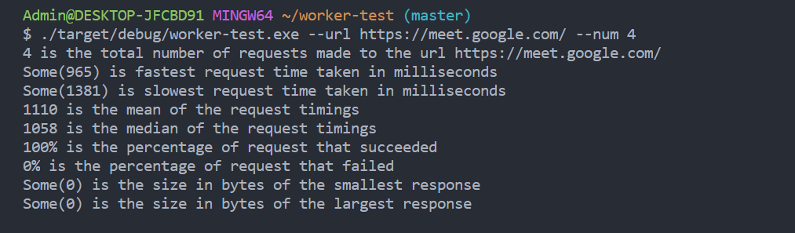

## Rust CLI tool

This is developed with rust and built with cargo. so make sure that you have both installed in your system.
[installing rust](https://www.rust-lang.org/tools/install)

After unzipping the file, open the root folder in cmd and type the command

## Building the project
```
cargo build
```
this command will build the binaries.

You will now be having the target folder and the executable file will be in the target > debug > worker-test.exe.

## Running CLI

after building the project type the following command 

```
./target/debug/worker-test.exe --help
```
this is the helper command which lists the usage and options


to test any website, run the following command

```
./target/debug/worker-test.exe --url  https://my-assignment.santhoshfsdev.workers.dev/links --num 4

in this

./target/debug/worker-test.exe - this is the executable file
--url https://my-assignment.santhoshfsdev.workers.dev/links - this is the url to which request is made
--num 4 - this denotes the number of times requests to be made

```
you can provide any url you want.

## Sample response

Testing  assignment [https://my-assignment.santhoshfsdev.workers.dev/links](https://my-assignment.santhoshfsdev.workers.dev/links)


Testing  assignment HTML page [https://my-assignment.santhoshfsdev.workers.dev/](https://my-assignment.santhoshfsdev.workers.dev/)


Testing google meet [https://meet.google.com](https://meet.google.com)



Testing github users api [https://api.github.com/users?since=135](https://api.github.com/users?since=135)


As the number of requests in the --num should be a positive number. If the input is a negative number, the program will exit


## Comparison

The metrics that you can view to compare are the fastest and slowest time taken for the request will be varied in the above image.

since we are making number of request to the same url, the pass and fail percentage will be either 0 or 100 and also the response length will be the same. Other parameters vary with request

